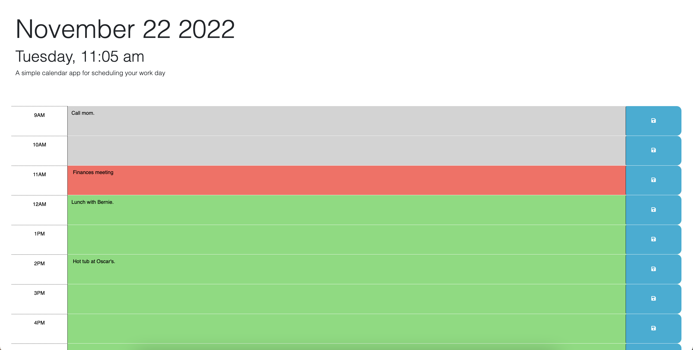

# 05 Third-Party APIs: Work Day Scheduler

## Description

This calendar application allows the user to add and save events scheduled for the normal working hours of the day. Each hour timeslot is color-coded based on whether the hour is current, already passed, or in the future. At the beginning of a new day, the calendar refreshes, so you can start anew!

The goal of this application is to help busy professionals keep track of their day-to-day tasks, meetings, and commitments.

## Installation

To run this application, you just need wifi, and a working internet browser. Navigate to this link to find your calendar: https://danwillett.github.io/daily-planner/

## Usage

Use this application by writing in your scheduled tasks in the hour time slots and clicking the save button. If you close the calendar page, your tasks will still be there you open your page back up, unless it's a different day.

## Credits

BootStrap: https://getbootstrap.com/docs/5.2/getting-started/introduction/
DayJS: https://day.js.org/en/
Google Fonts: https://fonts.google.com/about

## License

MIT license
